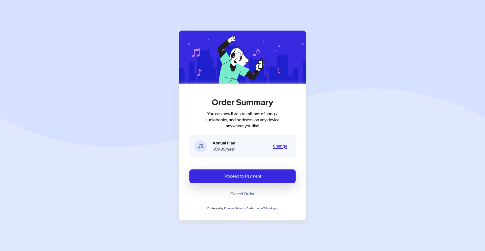

# Frontend Mentor - Order summary card solution

This is a solution to the [Order summary card challenge on Frontend Mentor](https://www.frontendmentor.io/challenges/order-summary-component-QlPmajDUj). Frontend Mentor challenges help you improve your coding skills by building realistic projects. 

## Table of contents

- [Overview](#overview)
  - [The challenge](#the-challenge)
  - [Screenshot](#screenshot)
  - [Links](#links)
- [My process](#my-process)
  - [Built with](#built-with)
  - [What I learned](#what-i-learned)
- [Author](#author)

**Note: Delete this note and update the table of contents based on what sections you keep.**

## Overview

### The challenge

Users should be able to:

- See hover states for interactive elements

### Screenshot

### Links

- Solution URL: [Github](https://github.com/jefffehringer/FrontendMentor-OrderSummary)
- Live Site URL: [Add live site URL here](https://your-live-site-url.com)

## My process

### Built with

- CSS custom properties
- Flexbox
- Bootstrap 5

### What I learned

I'm terrible at CSS

## Author

- Github - [Jeff Fehringer](https://github.com/jefffehringer)
- Frontend Mentor - [@jefffehringer](https://www.frontendmentor.io/profile/jefffehringer)
- Twitter - [@jefftfehringer](https://www.twitter.com/jefftfehringer)
